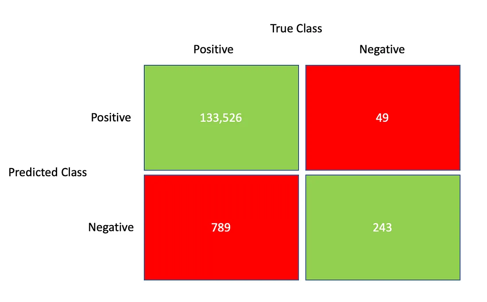

- __First Name__: ...
- __Last Name__: ...
- __Student ID__: ...

This part is meant to last about one hour. It must be sent through the usual Nuvolos mechanism by 12pm. Don't worry if it is not finished.

You are free to use any online resource. The symbol 🔍 indicates that a google search might help you if you are stuck.

It is however strictly forbidden to communicate with other students.

In answering the questions below, don't hesitate to comment abundantly your code, to reflect on what you are doing and take initiatives when you deem it relevant.

Happy coding ! 💪


## Exercise 1:

Consider the following text:

```{python}
txt = """Blandit aliquam etiam erat velit scelerisque.
Fusce id velit ut tortor pretium.
Cursus turpis massa tincidunt dui ut ornare lectus.
Fermentum odio eu feugiat pretium nibh ipsum.
Urna porttitor rhoncus dolor purus non enim praesent elementum facilisis.
Ipsum faucibus vitae aliquet nec ullamcorper sit amet risus nullam."""
```

__Print the string__

```{python}
#
```

__Programmatically count the number of occurences of word `ipsum` (🔍)__

```{python}
#
```

__(Bonus) Programmatically count the number of words in the string.__

```{python}
#
```


## Exercise 2: Confusion Matrix

The following matrix, shows a confusion matrix resulting from the evaluation of a credit card fraud detection algorithm (Positive=Fraud).


Compute the following statistics (🔍)

- False Positive Rate?
- False Negative Rate?
- Accuracy?


How would you assess the quality of the said algorithm?


```{python}
# fpr = 
```

```{python}
# fnr = 
```

```{python}
# accuracy = 
```

---
## Exercise 3: Gold and Silver

__Import the `goldsilver.csv` file as a dataframe. It contains several simultaneous quotes for the prices of gold and silver. Show the first few observations. What are the column names?__

```{python}
# some useful imports
import pandas as pd
from matplotlib import pyplot as plt
```

```{python}
# df = 
```

```{python}
# 
```

__Make a scatterplot (🔍 matplotlib) with the price of silver as a function of the price of gold.__

```{python}
#
```

__Compute the actual correlation between the two series.__

```{python}
#
```


## Exercise 4: Do guns reduce crime

*General context*

Some american states have specific so-called "shall carry" laws which facilitates the obtention of a carrying permit. Supporters of the laws argue that weopons carried and concealed by regular citizens act as a deterrent for crime.

From a european perspective, it sounds like a dangerous fantasy.

However, the data is not so clearcut and early studies have mostly supported the deterring hypothesis.  From the bestseller [More guns less crime](https://en.wikipedia.org/wiki/More_Guns,_Less_Crime), to more recent academic studies ([Shooting Down the ‘More Guns Less Crime’ Hypothesis.](https://www.nber.org/papers/w9336) or the latest studies by the [Rand Corporation](https://www.rand.org/research/gun-policy.html)), the academic debate is still lively, although it seems to be slowly settling against guns.

The goal here is to make a first preliminary regression, to enter the debate...

### Importing and describing the data

Import the Guns dataset from the AER package in R-Dataset library.

```{python}
import statsmodels
import statsmodels.datasets
dataset = statsmodels.datasets.get_rdataset("Guns", package="AER")
```

```{python}
# import dataframe
df = dataset['data']
```

__Print the documentation from the package__
(hint: check `dataset.keys()`)

```{python}
# 
```

__How many observations are there? How many dates? How many states?__

```{python}
#
```

__Describe the data by making for each column a short description of what the data represents and how it is coded.__

```{python}
#
```

__Compute the correlation matrix and comment on a few pairs of variables (2 or 3) that are highly correlated. Bonus: make a graphical representation of the correlation matrix.__


```{python}
#
```


### Regression Analysis

__Perform a simple one dimensional regression, explaining the violent crime rate by the presence of a shall-carry law. Comment on the results.__

```{python}
import statsmodels.formula.api as sm
from numpy import log # needed if you use log in formulas
```

```{python}
#| tags: []
# reminder of the API
model = sm.ols(formula="your_formula_goes_there", data=df)
result = model.fit()
result.summary()
```

```{python}
#
```

__Augment the regression with all *relevant* factors present in the table (excluding "Year" and "Country"). Comment on the results (including significance and signs of various regressors).__

```{python}
#
```

__What is the percentage increase in violent crimes associated to a 1% increase in income?__

```{python}
#
```

__Run the same regression as before to explain murder rate and robbery rate. What kind of crime is most affected by the shall carry law?__

```{python}
#
```

__Other comments?__

```{python}
#
```

